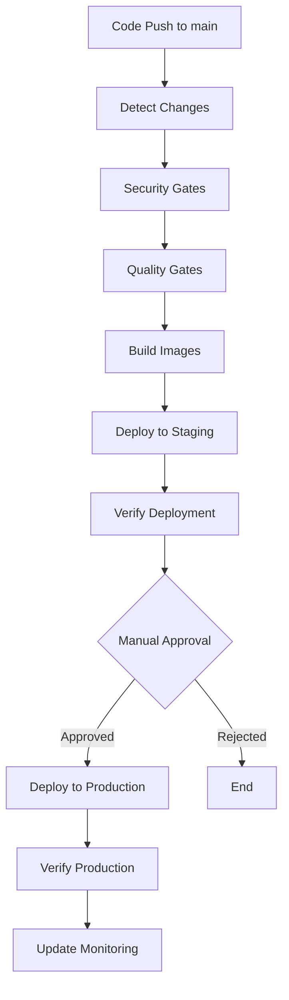

# GitHub Actions Deployment Guide

This document provides comprehensive instructions for using the new GitHub Actions-based deployment system that replaces manual ACR deployment processes.

## Overview

The new deployment system provides:
- **Automated CI/CD**: Build and deploy containers automatically
- **Security Gates**: Integrated security scanning and compliance checks  
- **Change Detection**: Only deploy components that have actually changed
- **Deployment Tracking**: Full traceability via GitHub Deployment API
- **Rollback Capabilities**: Emergency rollback workflows
- **Environment Management**: Proper staging and production environments
- **Monitoring Integration**: Azure Log Analytics integration

## Architecture



## Quick Start

### 1. Repository Setup

First, configure the required repository variables and secrets:

```bash
# Run the setup workflow to validate configuration
gh workflow run setup-deployment-environment.yml --field environment=staging
```

### 2. Automatic Deployments

Push to the `main` branch triggers automatic staging deployment:

```bash
git push origin main
```

### 3. Production Deployments

Production deployments require manual approval:

```bash
gh workflow run build-deploy.yml --field environment=production
```

## Configuration

### Required Repository Variables

Configure these in **Repository Settings → Secrets and variables → Actions → Variables**:

#### Azure Authentication
```
AZURE_SUBSCRIPTION_ID=your-subscription-id
AZURE_TENANT_ID=your-tenant-id
AZURE_CLIENT_ID=your-service-principal-client-id
```

#### Azure Resources (Staging)
```
ACA_RG=your-container-apps-resource-group
ACA_ENV=your-container-apps-environment
ACA_APP_API=your-api-container-app-name
ACA_APP_WEB=your-web-container-app-name
```

#### Azure Resources (Production - Optional)
```
PROD_ACA_RG=your-prod-resource-group
PROD_ACA_APP_API=your-prod-api-app-name
PROD_ACA_APP_WEB=your-prod-web-app-name
```

#### Container Registry (Choose One)

**Option 1: Azure Container Registry**
```
ACR_LOGIN_SERVER=yourregistry.azurecr.io
ACR_USERNAME=admin-username
```

**Option 2: GitHub Container Registry (Default)**
No configuration needed - uses `GITHUB_TOKEN` automatically.

### Required Repository Secrets

Configure these in **Repository Settings → Secrets and variables → Actions → Secrets**:

```
ACR_PASSWORD=your-acr-admin-password  # Only if using ACR
```

### Optional: Monitoring Integration

For enhanced monitoring and deployment tracking:

```
LOG_ANALYTICS_WORKSPACE_ID=your-workspace-id
LOG_ANALYTICS_SHARED_KEY=your-shared-key
```

## Workflows

### Main Deployment Workflow

**File**: `.github/workflows/build-deploy.yml`

**Triggers**:
- Push to `main` branch (automatic staging)
- Manual dispatch (choose environment)

**Features**:
- Change detection (API/Web)
- Integrated security scanning
- Quality gates
- Container image building
- Automated staging deployment
- Manual production approval
- Deployment verification
- Status tracking

**Usage**:
```bash
# Automatic (push to main)
git push origin main

# Manual staging
gh workflow run build-deploy.yml --field environment=staging

# Manual production  
gh workflow run build-deploy.yml --field environment=production

# Force deploy (skip some gates)
gh workflow run build-deploy.yml --field environment=staging --field force_deploy=true
```

### Security Gates Workflow

**File**: `.github/workflows/security-gates.yml`

**Features**:
- CodeQL analysis
- Container vulnerability scanning  
- Dependency review
- Compliance checks
- Configurable security thresholds

**Integration**:
- Called automatically by main deployment workflow
- Can be run independently for security audits
- Blocks deployment if critical vulnerabilities found

### Rollback Workflow

**File**: `.github/workflows/rollback.yml`

**Usage**:
```bash
# Emergency rollback
gh workflow run rollback.yml \
  --field environment=production \
  --field rollback_target=abc123 \
  --field component=both \
  --field reason=\"Critical bug fix\"\n\n# Rollback specific component\ngh workflow run rollback.yml \\\n  --field environment=staging \\\n  --field rollback_target=def456 \\\n  --field component=api \\\n  --field reason=\"API performance issue\"\n```\n\n### Environment Setup Workflow\n\n**File**: `.github/workflows/setup-deployment-environment.yml`\n\n**Purpose**: Validate configuration and setup deployment environments\n\n**Usage**:\n```bash\n# Validate staging setup\ngh workflow run setup-deployment-environment.yml --field environment=staging\n\n# Validate production setup\ngh workflow run setup-deployment-environment.yml --field environment=production\n\n# Reset environment configuration\ngh workflow run setup-deployment-environment.yml \\\n  --field environment=staging \\\n  --field reset_config=true\n```\n\n## Deployment Process\n\n### Staging Deployment\n\n1. **Automatic Trigger**: Push to `main` branch\n2. **Change Detection**: Identifies modified components\n3. **Security Scanning**: Runs comprehensive security checks\n4. **Quality Gates**: Validates code quality and builds\n5. **Image Building**: Builds only changed components\n6. **Deployment**: Updates Azure Container Apps\n7. **Verification**: Runs health checks and validation\n8. **Status Update**: Updates GitHub deployment status\n\n### Production Deployment\n\n1. **Manual Trigger**: Requires explicit workflow dispatch\n2. **Production Gates**: Additional validation for production readiness\n3. **Approval Required**: Manual approval gate (configurable)\n4. **Deployment Tracking**: Creates GitHub deployment record\n5. **Blue-Green Strategy**: Safe production deployment\n6. **Health Monitoring**: Comprehensive post-deployment validation\n7. **Rollback Ready**: Automatic rollback preparation\n\n## Security Features\n\n### Security Scanning\n\n- **Code Analysis**: CodeQL for Python and TypeScript\n- **Dependency Scanning**: npm audit and Python security checks\n- **Container Scanning**: Trivy vulnerability scanning\n- **Secrets Detection**: Automated secrets scanning\n- **Compliance Checks**: Security configuration validation\n\n### Security Thresholds\n\nConfigurable in `.github/workflows/security-gates.yml`:\n\n```yaml\nenv:\n  SECURITY_FAIL_ON_HIGH: false      # Set to true for stricter gates\n  SECURITY_FAIL_ON_CRITICAL: true   # Always fail on critical vulnerabilities\n```\n\n### Authentication Security\n\n- **Managed Identity**: Uses Azure managed identities for container apps\n- **OIDC Authentication**: GitHub OIDC for Azure authentication\n- **Minimal Permissions**: Least-privilege access patterns\n- **Secret Management**: Proper separation of secrets and variables\n\n## Monitoring and Observability\n\n### Deployment Tracking\n\n- **GitHub Deployments API**: Full deployment history\n- **Status Updates**: Real-time deployment status\n- **Environment URLs**: Direct links to deployed applications\n- **Rollback History**: Complete rollback audit trail\n\n### Azure Log Analytics Integration\n\n```bash\n# View deployment metrics\naz monitor log-analytics query \\\n  --workspace \"your-workspace\" \\\n  --analytics-query \"DeploymentVerification_CL | where TimeGenerated > ago(24h)\"\n```\n\n### Health Monitoring\n\n- **Automatic Health Checks**: Post-deployment validation\n- **Performance Monitoring**: Response time validation\n- **Availability Monitoring**: Service uptime verification\n- **Error Rate Monitoring**: Application error tracking\n\n## Troubleshooting\n\n### Common Issues\n\n#### Authentication Failures\n\n```bash\n# Verify Azure authentication\naz account show\n\n# Check service principal permissions\naz role assignment list --assignee $AZURE_CLIENT_ID\n\n# Validate OIDC configuration\ngh workflow run setup-deployment-environment.yml --field environment=staging\n```\n\n#### Container Registry Issues\n\n```bash\n# Test ACR access\ndocker login $ACR_LOGIN_SERVER\n\n# Test GHCR access  \necho $GITHUB_TOKEN | docker login ghcr.io -u $GITHUB_ACTOR --password-stdin\n\n# Verify managed identity can pull images\naz role assignment list --scope /subscriptions/$SUBSCRIPTION_ID/resourceGroups/$RG_NAME\n```\n\n#### Deployment Failures\n\n```bash\n# Check container app logs\naz containerapp logs show --name $ACA_APP_API --resource-group $ACA_RG\n\n# Verify deployment status\naz containerapp revision list --name $ACA_APP_API --resource-group $ACA_RG\n\n# Run verification manually\n./scripts/verify_live.sh --staging\n```\n\n### Debug Mode\n\nEnable debug logging by setting repository variable:\n```\nDEBUG_MODE=true\n```\n\n### Support Bundle\n\nGenerate comprehensive diagnostics:\n```bash\n./scripts/support_bundle.sh\n```\n\n## Migration from Manual ACR Deployment\n\n### Step 1: Validate Current Setup\n\n```bash\n# Check current infrastructure\ncd infra\nterraform output\n\n# Verify current deployments\naz containerapp list --resource-group $ACA_RG --output table\n```\n\n### Step 2: Configure GitHub Actions\n\n1. Set up repository variables (see Configuration section)\n2. Run environment setup workflow\n3. Test with staging deployment\n\n### Step 3: Transition Process\n\n```bash\n# 1. Test new workflow with staging\ngh workflow run build-deploy.yml --field environment=staging\n\n# 2. Verify deployment\n./scripts/verify_live.sh --staging\n\n# 3. Compare with manual deployment\n# (Compare URLs, functionality, performance)\n\n# 4. Switch to production when ready\ngh workflow run build-deploy.yml --field environment=production\n```\n\n### Step 4: Deprecate Manual Processes\n\n1. Update team documentation\n2. Remove manual deployment scripts\n3. Archive old deployment processes\n4. Train team on new workflows\n\n## Best Practices\n\n### Development Workflow\n\n```bash\n# 1. Feature development\ngit checkout -b feature/new-feature\n# ... make changes ...\ngit push origin feature/new-feature\n\n# 2. Create pull request\ngh pr create --title \"Add new feature\" --body \"Description\"\n\n# 3. Merge after approval (triggers staging deployment)\ngh pr merge --squash\n\n# 4. Verify staging\ngh workflow list --limit 1  # Check latest run\n\n# 5. Deploy to production when ready\ngh workflow run build-deploy.yml --field environment=production\n```\n\n### Security Best Practices\n\n1. **Regular Security Scans**: Schedule weekly security scans\n2. **Dependency Updates**: Keep dependencies current\n3. **Secrets Rotation**: Rotate service principal secrets regularly\n4. **Access Review**: Regularly review GitHub environment access\n5. **Audit Logs**: Monitor deployment audit logs\n\n### Operational Best Practices\n\n1. **Change Management**: Use pull requests for all changes\n2. **Testing**: Validate in staging before production\n3. **Monitoring**: Set up alerts for deployment failures\n4. **Documentation**: Keep runbooks updated\n5. **Incident Response**: Have rollback procedures ready\n\n## Advanced Configuration\n\n### Custom Security Rules\n\nCreate `.github/codeql/custom-queries.ql` for additional security rules.\n\n### Environment-Specific Variables\n\n```bash\n# Staging-specific variables\nSTAGING_API_TIMEOUT=30\nSTAGING_LOG_LEVEL=DEBUG\n\n# Production-specific variables  \nPROD_API_TIMEOUT=10\nPROD_LOG_LEVEL=INFO\n```\n\n### Custom Verification Steps\n\nExtend `scripts/verify_live.sh` with application-specific health checks.\n\n### Notification Integration\n\n```yaml\n# Add to workflow for Slack notifications\n- name: Notify deployment\n  if: always()\n  uses: 8398a7/action-slack@v3\n  with:\n    status: ${{ job.status }}\n    webhook_url: ${{ secrets.SLACK_WEBHOOK_URL }}\n```\n\n## Support and Resources\n\n### Documentation Links\n\n- [GitHub Actions Documentation](https://docs.github.com/en/actions)\n- [Azure Container Apps Documentation](https://docs.microsoft.com/en-us/azure/container-apps/)\n- [Azure OIDC Documentation](https://docs.microsoft.com/en-us/azure/developer/github/connect-from-azure)\n\n### Getting Help\n\n1. **GitHub Issues**: Create issue with `deployment` label\n2. **Team Docs**: Check internal team documentation\n3. **Runbooks**: Follow incident response runbooks\n4. **Support Bundle**: Generate diagnostics for support requests\n\n### Status Dashboard\n\n- **GitHub Actions**: Repository Actions tab\n- **Azure Portal**: Container Apps resource monitoring\n- **Log Analytics**: Deployment metrics dashboard\n\nThis deployment system provides enterprise-grade CI/CD capabilities with security, reliability, and observability built-in. The automated processes reduce manual errors while providing full traceability and rollback capabilities for production deployments."