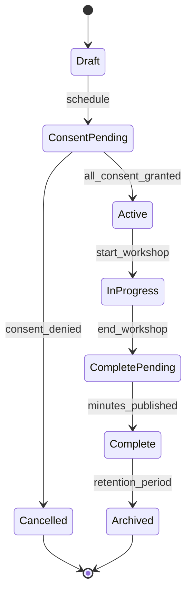

# ADR-004: Workshop Management and Minutes Lifecycle

**Status:** ✅ Planned  
**Date:** 2025-08-18  
**Sprint:** S4  

## Context

Sprint S4 introduces workshop management capabilities for collaborative security assessments with multiple stakeholders. The system needs to manage workshop sessions, capture meeting minutes with proper consent, and maintain immutable audit trails for compliance requirements.

Key requirements include:
- Workshop lifecycle management with participant consent tracking
- Automated minutes generation and publishing workflows  
- Immutable storage model for audit compliance
- GDPR-compliant consent capture and data retention
- Integration with existing assessment and engagement workflows

## Decision

We implement a consent-first workshop management system with immutable minutes lifecycle and comprehensive audit trails.

### Architecture Components

#### 1. **Consent Management Model**
```python
@dataclass
class WorkshopConsent:
    participant_id: str
    workshop_id: str  
    consent_type: Literal["recording", "minutes", "data_processing"]
    granted_at: datetime
    expires_at: Optional[datetime]
    revoked_at: Optional[datetime]
    consent_version: str  # Legal text version
```

**Consent Requirements:**
- ✅ Explicit consent before workshop recording/minutes
- ✅ Granular permissions (recording vs minutes vs data processing)
- ✅ Consent expiration and revocation support
- ✅ Legal basis tracking for GDPR Article 6

#### 2. **Workshop Lifecycle States**


#### 3. **Minutes Immutability Model**
- **Draft Phase:** Editable minutes in temporary storage
- **Review Phase:** Read-only minutes with participant review period (24-48h)
- **Published Phase:** Cryptographically sealed, immutable storage
- **Audit Trail:** All changes logged with digital signatures

```python
@dataclass  
class MinutesVersion:
    version_id: str
    workshop_id: str
    content_hash: str  # SHA-256 of content
    created_at: datetime
    created_by: str
    status: Literal["draft", "review", "published", "archived"]
    digital_signature: Optional[str]  # For published versions
    previous_version: Optional[str]
```

### Implementation Strategy

#### API Endpoints (planned):
```
POST /workshops                    # Create workshop
GET  /workshops/{id}/consent      # Consent status check  
POST /workshops/{id}/consent      # Grant/revoke consent
POST /workshops/{id}/minutes      # Generate draft minutes
PUT  /workshops/{id}/minutes      # Update draft (pre-publish)
POST /workshops/{id}/minutes/publish  # Immutable publish
GET  /workshops/{id}/minutes/{version}  # Retrieve minutes version
```

#### Security Controls:
- **Authentication:** Workshop creator and participant roles only
- **Consent Validation:** API blocks recording without explicit consent  
- **Digital Signatures:** HMAC-SHA256 sealing for published minutes
- **Audit Logging:** All consent changes and minutes access logged

## Consequences

### Positive
✅ **GDPR Compliance:** Explicit consent model meets data protection requirements  
✅ **Audit Trail:** Immutable minutes provide legal defensibility  
✅ **Participant Control:** Granular consent with revocation capabilities  
✅ **Data Integrity:** Cryptographic sealing prevents tampering  
✅ **Workflow Integration:** Seamless integration with existing assessment flow

### Negative  
⚠️ **Storage Overhead:** Immutable storage requires version history retention  
⚠️ **Consent Complexity:** Multi-stakeholder consent coordination complexity  
⚠️ **Performance Impact:** Digital signature verification adds processing overhead

### Risks and Mitigations

| Risk | Mitigation |
|------|------------|
| **Consent Withdrawal** | Graceful handling with data purge workflows |
| **Storage Bloat** | Automated archival policies and compression |
| **Signature Verification** | Async processing for signature operations |
| **Regulatory Changes** | Flexible consent version management |

## Alternative Considered

1. **Simple Recording Model:** Rejected due to GDPR consent requirements
2. **Mutable Minutes:** Rejected due to audit compliance needs  
3. **External Workshop Tools:** Rejected due to data sovereignty concerns

## Implementation Notes

**Phase 1:** Basic workshop CRUD with consent capture  
**Phase 2:** Draft minutes with collaborative editing  
**Phase 3:** Immutable publishing with digital signatures  
**Phase 4:** Advanced analytics and participant insights

**Dependencies:**  
- AAD integration for participant identity
- Azure Key Vault for signature key management  
- Cosmos DB for consent and minutes storage
- Service Bus for async processing workflows

## References

- [GDPR Article 6](https://gdpr.eu/article-6-how-to-process-personal-data-legally/) - Legal basis for processing
- [S4 Workshop Requirements](../README.md#s4-features)  
- [Security Implementation](./SECURITY.md#consent-capture-policy)
- [CSF Integration](./ADR-005-csf-skeleton.md)