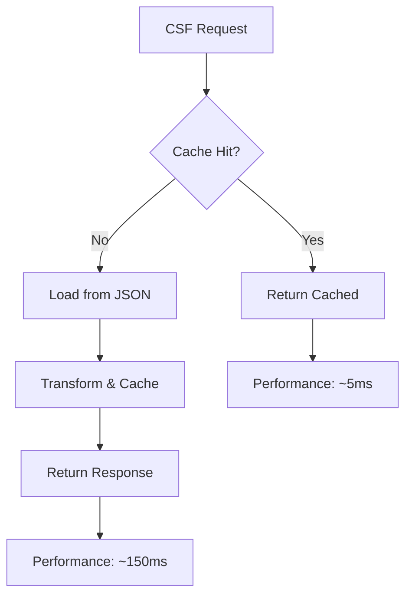

# ADR-005: NIST CSF 2.0 Framework Integration

**Status:** ✅ Planned  
**Date:** 2025-08-18  
**Sprint:** S4  

## Context

Sprint S4 requires integration with NIST Cybersecurity Framework (CSF) 2.0 to provide standardized assessment structure and industry-aligned maturity scoring. The system needs to support the new Govern function, maintain performance with large taxonomies, and provide flexible grid-based assessment interfaces.

CSF 2.0 introduces:
- **Six Functions:** Govern, Identify, Protect, Detect, Respond, Recover
- **Enhanced Taxonomy:** ~130 subcategories vs CSF 1.1's ~108
- **Outcome-Driven Approach:** Focus on business outcomes over technical controls  
- **Supply Chain Integration:** Embedded third-party risk considerations

## Decision

We implement a cacheable, grid-based CSF 2.0 integration with performance optimization and flexible assessment mapping capabilities.

### Architecture Components  

#### 1. **CSF 2.0 Taxonomy Source**
```python
@dataclass
class CSFCategory:
    function_id: str  # "GV", "ID", "PR", "DE", "RS", "RC"  
    category_id: str  # e.g., "GV.SC", "ID.AM"
    category_name: str
    subcategories: List[CSFSubcategory]
    
@dataclass
class CSFSubcategory:
    subcategory_id: str  # e.g., "GV.SC-01", "ID.AM-01" 
    outcome: str  # Business outcome description
    examples: List[str]  # Implementation examples
    references: List[str]  # Standards mappings
```

**Taxonomy Loading Strategy:**
- ✅ JSON source file with official NIST CSF 2.0 taxonomy
- ✅ In-memory caching with 30-minute TTL for performance
- ✅ Lazy loading of subcategory details on-demand
- ✅ Version tracking for taxonomy updates

#### 2. **Performance Considerations**


**Optimization Strategies:**
- **Selective Loading:** Load function/category metadata first, subcategories on-demand
- **Compression:** Gzip JSON responses for network efficiency  
- **CDN Strategy:** Static CSF taxonomy served via CDN in production
- **Lazy Grid:** Virtualized scrolling for large subcategory grids

#### 3. **Grid Assessment Approach**
```typescript
interface CSFGridAssessment {
  engagement_id: string;
  function_id: string;
  categories: {
    [category_id: string]: {
      subcategories: {
        [subcategory_id: string]: {
          current_level: 1 | 2 | 3 | 4 | 5;
          target_level: 1 | 2 | 3 | 4 | 5;
          evidence_urls: string[];
          notes: string;
          assessed_at: string;
        }
      }
    }
  }
}
```

**Grid Features:**
- ✅ Function-by-function assessment workflow
- ✅ Current vs target state gap analysis
- ✅ Bulk operations (select all, copy assessments)
- ✅ Excel-like keyboard navigation
- ✅ Real-time validation and scoring

### Implementation Strategy

#### API Endpoints (planned):
```
GET  /csf/functions                    # List 6 CSF functions
GET  /csf/functions/{id}/categories    # Categories for function
GET  /csf/categories/{id}/subcategories # Subcategories with examples
POST /assessments/{id}/csf/grid        # Save grid assessment data
GET  /assessments/{id}/csf/gaps        # Generate gap analysis
GET  /csf/seed                         # Local development test data
```

#### Database Schema:
```sql
-- CSF assessments linked to main assessment
CREATE TABLE csf_assessments (
    id UUID PRIMARY KEY,
    assessment_id UUID REFERENCES assessments(id),
    function_id VARCHAR(2) NOT NULL,  -- GV, ID, PR, DE, RS, RC
    category_id VARCHAR(10) NOT NULL, -- GV.SC, ID.AM, etc
    subcategory_id VARCHAR(15) NOT NULL, -- GV.SC-01, ID.AM-01
    current_level INTEGER CHECK (current_level BETWEEN 1 AND 5),
    target_level INTEGER CHECK (target_level BETWEEN 1 AND 5), 
    evidence_urls JSONB DEFAULT '[]',
    notes TEXT,
    created_at TIMESTAMP DEFAULT NOW(),
    updated_at TIMESTAMP DEFAULT NOW()
);
```

## Consequences

### Positive
✅ **Industry Alignment:** CSF 2.0 provides recognized cybersecurity framework  
✅ **Comprehensive Coverage:** 6 functions cover full security lifecycle  
✅ **Performance Optimized:** Caching and lazy loading support large taxonomies  
✅ **Gap Analysis:** Built-in current vs target assessment capabilities  
✅ **Evidence Integration:** Links assessment answers to supporting documentation

### Negative
⚠️ **Taxonomy Complexity:** 130+ subcategories create overwhelming user experience  
⚠️ **Cache Dependencies:** Stale cache could serve outdated taxonomy information  
⚠️ **Storage Overhead:** Grid assessments generate large datasets per engagement

### Risks and Mitigations

| Risk | Mitigation |
|------|------------|
| **NIST Updates** | Version tracking with backward compatibility |
| **Performance Degradation** | Monitoring cache hit rates and response times |
| **User Experience Complexity** | Progressive disclosure and guided workflows |
| **Data Inconsistency** | Validation rules and referential integrity |

## Alternative Considered

1. **Real-time NIST API:** Rejected due to performance and availability concerns
2. **Full Taxonomy Loading:** Rejected due to client-side performance impact  
3. **Custom Framework:** Rejected due to industry standardization needs
4. **Database-Stored Taxonomy:** Rejected due to update complexity

## Implementation Notes

**Local CSF Seed Data:**
```json
{
  "nist-csf-2.0": {
    "version": "2.0.0",
    "functions": {
      "GV": { "name": "Govern", "categories": 6 },
      "ID": { "name": "Identify", "categories": 6 },  
      "PR": { "name": "Protect", "categories": 7 },
      "DE": { "name": "Detect", "categories": 3 },
      "RS": { "name": "Respond", "categories": 5 },
      "RC": { "name": "Recover", "categories": 3 }
    }
  }
}
```

**Integration Points:**
- Framework cache service for taxonomy management
- Assessment service for grid data persistence  
- Evidence service for supporting documentation
- Scoring service for gap analysis calculations

**Performance Targets:**
- Taxonomy loading: < 200ms cold start
- Grid operations: < 50ms per cell update
- Cache hit rate: > 90% for taxonomy requests
- Gap analysis: < 2s for full assessment

## References

- [NIST CSF 2.0 Official](https://www.nist.gov/cyberframework) - Official framework documentation
- [S4 CSF Requirements](../README.md#s4-features)
- [Framework Cache Service](../app/services/framework_cache.py)
- [Assessment Schema](../app/api/schemas/assessment.py)