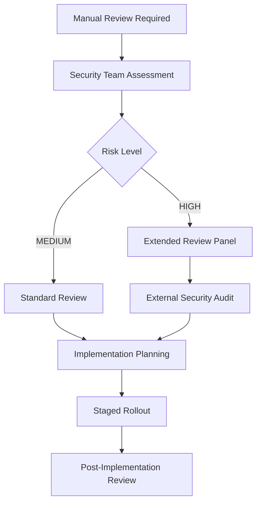

# Security Remediation Procedures

This document outlines comprehensive procedures for automated and manual security remediation in the AI-Enabled Cyber Maturity Assessment platform.

## 🎯 Overview

The remediation system provides:
- **Auto-Safe Remediation**: Automated fixes for low-risk security issues
- **Manual Review Process**: Structured approach for high-risk changes
- **Risk Assessment**: Classification of security issues by risk level
- **Audit Trail**: Complete tracking of all remediation activities

## 🔒 Auto-Safe Remediation System

### Scope of Auto-Safe Fixes

#### ✅ Always Safe (Auto-Applied)
- **Dependency Patch Updates**: Patch version updates (e.g., 1.2.3 → 1.2.4)
- **Security Header Configuration**: Adding standard security headers
- **Logging Improvements**: Masking sensitive data in logs
- **Configuration Hardening**: Safe security setting adjustments
- **Documentation Updates**: Security documentation improvements

#### ⚠️ Conditionally Safe (Auto-Applied with Validation)
- **Minor Dependency Updates**: Minor version updates for non-core packages
- **Input Validation Enhancements**: Adding basic validation rules
- **Error Handling Improvements**: Sanitizing error messages
- **Static File Security**: Secure serving configurations

#### 🚫 Never Auto-Applied (Manual Review Required)
- **Major Dependency Updates**: Major version changes
- **Authentication Flow Changes**: Login/logout logic modifications
- **Database Schema Changes**: Any data structure modifications
- **API Breaking Changes**: Endpoint signature changes
- **Cryptographic Changes**: Encryption/hashing algorithm updates

### Auto-Remediation Process

#### 1. Scan Result Analysis
```python
# Risk assessment algorithm
def assess_risk_level(finding, change):
    risk_score = 0
    
    # Dependency risk factors
    if finding.category == 'dependency':
        if is_major_version_change(change):
            risk_score += 50
        elif is_core_package(finding.package_name):
            risk_score += 30
        elif is_minor_version_change(change):
            risk_score += 10
    
    # Code change risk factors
    if affects_authentication(change):
        risk_score += 60
    elif affects_data_handling(change):
        risk_score += 40
    elif affects_api_interface(change):
        risk_score += 30
    
    return 'safe' if risk_score < 20 else 'medium' if risk_score < 50 else 'high'
```

#### 2. Safe Fix Application
```bash
# Automated remediation execution
python scripts/security/auto_remediate.py \
    --scan-results=scan-results/ \
    --mode=auto_safe \
    --commit-changes=true
```

#### 3. Validation & Testing
- Automated syntax validation
- Basic functionality tests
- Security regression checks
- Compliance validation

### Auto-Safe Fix Categories

#### Dependency Management
```python
# Example: Safe dependency update
# From requirements.txt
requests==2.28.1  # Known vulnerability

# Auto-remediated to
requests==2.28.2  # Security patch
```

**Criteria for Auto-Safe Dependency Updates:**
- Patch-level updates only (Z in X.Y.Z)
- Security-focused updates
- No breaking changes in changelog
- Package not in core framework list

#### Security Headers
```python
# Example: Adding security headers to FastAPI
@app.middleware("http")
async def add_security_headers(request: Request, call_next):
    response = await call_next(request)
    response.headers["X-Content-Type-Options"] = "nosniff"
    response.headers["X-Frame-Options"] = "DENY"
    response.headers["X-XSS-Protection"] = "1; mode=block"
    return response
```

**Auto-Applied Security Headers:**
- X-Content-Type-Options: nosniff
- X-Frame-Options: DENY
- X-XSS-Protection: 1; mode=block
- Referrer-Policy: strict-origin-when-cross-origin

#### Sensitive Data Masking
```python
# Before (vulnerable)
logger.info(f"User login: {user_email}, password: {password}")

# After (auto-remediated)
logger.info(f"User login: {user_email}, password: ***REDACTED***")
```

**Auto-Masked Patterns:**
- password, passwd, pwd
- secret, secret_key
- token, access_token, api_key
- credentials, auth_key

## 🔍 Manual Review Process

### High-Risk Change Categories

#### Authentication & Authorization
```yaml
Risk Level: HIGH
Review Required: Security Team + Lead Developer
Timeline: 2-5 business days
Approval: 2 reviewers minimum

Examples:
- OAuth flow modifications
- JWT implementation changes
- Role-based access control updates
- Session management changes
```

#### Database & Data Handling
```yaml
Risk Level: HIGH
Review Required: Data Team + Security Team
Timeline: 3-7 business days
Approval: DPO + Security Lead

Examples:
- Schema migrations
- Data retention policy changes
- Personal data processing modifications
- Database access pattern changes
```

#### Cryptographic Operations
```yaml
Risk Level: CRITICAL
Review Required: Security Architect + External Audit
Timeline: 5-10 business days
Approval: CISO + Technical Director

Examples:
- Encryption algorithm changes
- Key management modifications
- Certificate updates
- Hashing function changes
```

### Manual Review Workflow

#### 1. Issue Creation
```yaml
# Auto-generated GitHub issue for manual review
Title: "[SECURITY] Manual Review Required: {finding_type}"
Labels: ["security", "manual-review", "{priority}"]
Assignees: [security-team, relevant-team-lead]

Template:
## Security Finding Details
- **Finding ID**: {finding_id}
- **Risk Level**: {risk_level}
- **Category**: {category}
- **Affected Components**: {components}

## Proposed Remediation
{remediation_details}

## Risk Assessment
{risk_analysis}

## Required Approvals
- [ ] Security Team Review
- [ ] Technical Lead Approval
- [ ] Business Owner Sign-off (if applicable)

## Testing Requirements
- [ ] Security Testing
- [ ] Functional Testing
- [ ] Performance Testing
- [ ] Compliance Validation
```

#### 2. Review Process


#### 3. Implementation Standards
```yaml
Security Review Checklist:
- [ ] Threat model updated
- [ ] Security tests implemented
- [ ] Monitoring & alerting configured
- [ ] Rollback plan documented
- [ ] Compliance impact assessed
- [ ] Documentation updated

Technical Review Checklist:
- [ ] Code review completed
- [ ] Performance impact assessed
- [ ] Breaking change analysis
- [ ] Migration plan documented
- [ ] Backward compatibility verified
```

## 🛠️ Remediation Implementation

### Safe Remediation Examples

#### 1. FastAPI Security Headers
```python
# File: app/api/main.py
# Auto-remediation: Add security middleware

from fastapi import FastAPI, Request
from fastapi.middleware.cors import CORSMiddleware

app = FastAPI()

# AUTO-GENERATED: Security headers middleware
@app.middleware("http")
async def add_security_headers(request: Request, call_next):
    """Security headers middleware - auto-generated by security remediation."""
    response = await call_next(request)
    
    # Prevent MIME type sniffing
    response.headers["X-Content-Type-Options"] = "nosniff"
    
    # Prevent clickjacking
    response.headers["X-Frame-Options"] = "DENY"
    
    # Enable XSS protection
    response.headers["X-XSS-Protection"] = "1; mode=block"
    
    # Control referrer information
    response.headers["Referrer-Policy"] = "strict-origin-when-cross-origin"
    
    # HSTS for HTTPS
    if request.url.scheme == "https":
        response.headers["Strict-Transport-Security"] = "max-age=31536000; includeSubDomains"
    
    return response
```

#### 2. Next.js Security Configuration
```typescript
// File: web/next.config.js
// Auto-remediation: Add security headers

/** @type {import('next').NextConfig} */
const nextConfig = {
  // AUTO-GENERATED: Security headers configuration
  async headers() {
    return [
      {
        source: '/(.*)',
        headers: [
          {
            key: 'X-Content-Type-Options',
            value: 'nosniff',
          },
          {
            key: 'X-Frame-Options',
            value: 'DENY',
          },
          {
            key: 'X-XSS-Protection',
            value: '1; mode=block',
          },
          {
            key: 'Referrer-Policy',
            value: 'strict-origin-when-cross-origin',
          },
        ],
      },
    ];
  },
};

module.exports = nextConfig;
```

#### 3. Dependency Update
```requirements
# File: app/requirements.txt
# Before (vulnerable)
requests==2.28.1

# After (auto-remediated)
requests==2.28.2  # Security update: CVE-2023-XXXX fixed
```

### Manual Remediation Examples

#### 1. Authentication Flow Enhancement
```python
# Requires manual review - authentication changes
from fastapi import Depends, HTTPException, status
from fastapi.security import HTTPBearer
import jwt

security = HTTPBearer()

async def verify_token(token: str = Depends(security)):
    """Enhanced token verification with additional security checks."""
    try:
        # Decode and verify JWT
        payload = jwt.decode(token.credentials, SECRET_KEY, algorithms=["HS256"])
        
        # MANUAL REVIEW REQUIRED: Additional security validations
        # - Check token expiration with buffer
        # - Verify issuer and audience
        # - Check for token revocation
        # - Validate user permissions
        
        return payload
    except jwt.ExpiredSignatureError:
        raise HTTPException(
            status_code=status.HTTP_401_UNAUTHORIZED,
            detail="Token has expired"
        )
    except jwt.InvalidTokenError:
        raise HTTPException(
            status_code=status.HTTP_401_UNAUTHORIZED,
            detail="Invalid token"
        )
```

## 📊 Remediation Tracking

### Metrics & KPIs

#### Auto-Remediation Metrics
```yaml
Efficiency Metrics:
- Auto-fix success rate: >95%
- Time to remediation: <1 hour for safe fixes
- False positive rate: <5%
- Regression incidents: 0 per month

Quality Metrics:
- Security score improvement: Track before/after
- Vulnerability reduction: Monthly trends
- Compliance gap closure: Quarterly assessment
```

#### Manual Review Metrics
```yaml
Process Metrics:
- Average review time: <48 hours for medium risk
- Review backlog: <10 open items
- Approval time: <5 business days for high risk
- Implementation success rate: >98%

Quality Metrics:
- Security incidents post-remediation: 0
- Rollback frequency: <2% of implementations
- Stakeholder satisfaction: >4.5/5
```

### Audit Trail

#### Automated Remediation Log
```json
{
  "remediation_id": "rem_20250817_001",
  "timestamp": "2025-08-17T10:30:00Z",
  "scan_id": "scan_20250817_daily",
  "findings_processed": 15,
  "auto_fixes_applied": 12,
  "manual_review_required": 3,
  "changes": [
    {
      "type": "dependency_update",
      "file": "app/requirements.txt",
      "change": "requests: 2.28.1 → 2.28.2",
      "reason": "Security patch for CVE-2023-XXXX",
      "risk_level": "safe"
    }
  ],
  "validation_results": {
    "syntax_check": "passed",
    "security_regression": "passed",
    "functionality_test": "passed"
  },
  "commit_hash": "abc123def456",
  "approval_status": "auto_approved"
}
```

#### Manual Review Audit
```json
{
  "review_id": "rev_20250817_001",
  "finding_id": "finding_20250817_005",
  "review_type": "manual",
  "risk_level": "high",
  "reviewers": [
    {
      "name": "security-lead@company.com",
      "role": "Security Lead",
      "approval": "approved",
      "timestamp": "2025-08-17T14:30:00Z",
      "comments": "Implementation plan approved with additional monitoring"
    }
  ],
  "implementation_plan": {
    "phases": ["dev", "staging", "production"],
    "rollback_procedure": "documented",
    "monitoring_requirements": "enhanced_logging",
    "timeline": "5 business days"
  },
  "approval_status": "approved_with_conditions"
}
```

## 🚨 Emergency Procedures

### Critical Vulnerability Response

#### Immediate Actions (0-4 hours)
1. **Assessment**: Confirm vulnerability severity and impact
2. **Containment**: Implement temporary mitigations
3. **Communication**: Notify stakeholders and customers
4. **Remediation**: Deploy emergency fixes

#### Emergency Auto-Remediation
```bash
# Override safety checks for critical vulnerabilities
python scripts/security/auto_remediate.py \
    --mode=emergency \
    --severity=critical \
    --auto-deploy=true \
    --skip-testing=false
```

### Rollback Procedures

#### Auto-Remediation Rollback
```bash
# Rollback last auto-remediation
git revert $(git log --oneline -n 1 --grep="Auto-remediation" --format="%H")

# Rollback specific remediation by ID
python scripts/security/rollback_remediation.py --remediation-id=rem_20250817_001
```

#### Manual Remediation Rollback
```bash
# Staged rollback process
1. Revert changes in production
2. Update staging environment
3. Re-run security scans
4. Validate system functionality
5. Update documentation
```

## 📋 Best Practices

### Development Team Guidelines

#### Before Implementing Fixes
- [ ] Understand the security implication
- [ ] Review automated remediation suggestions
- [ ] Test changes in isolated environment
- [ ] Validate against compliance requirements
- [ ] Document implementation decisions

#### During Implementation
- [ ] Follow secure coding practices
- [ ] Implement comprehensive error handling
- [ ] Add appropriate logging and monitoring
- [ ] Include security regression tests
- [ ] Update relevant documentation

#### After Implementation
- [ ] Verify security improvement metrics
- [ ] Monitor for unexpected side effects
- [ ] Update threat models if applicable
- [ ] Share lessons learned with team
- [ ] Schedule follow-up security review

### Security Team Guidelines

#### Review Criteria
- [ ] Change aligns with security architecture
- [ ] Risk assessment is accurate and complete
- [ ] Testing plan covers security scenarios
- [ ] Monitoring and alerting are adequate
- [ ] Compliance impact is properly assessed

#### Approval Standards
- [ ] Technical implementation is sound
- [ ] Business risk is acceptable
- [ ] Rollback plan is viable
- [ ] Documentation is complete
- [ ] Team training needs are identified

## 🔧 Configuration Management

### Remediation Policy Configuration
```yaml
# File: scripts/security/remediation_config.yml
auto_remediation:
  enabled: true
  max_risk_score: 20
  allowed_categories:
    - dependency_patch_updates
    - security_headers
    - logging_improvements
    - config_hardening
  
  excluded_packages:
    - fastapi  # Core framework - requires manual review
    - next     # Core framework - requires manual review
    - react    # Core framework - requires manual review
  
  safety_checks:
    syntax_validation: true
    regression_testing: true
    compliance_validation: true
    
manual_review:
  required_approvers: 2
  escalation_timeout: 48h
  emergency_override: security_lead
  
  approval_matrix:
    low_risk: [team_lead]
    medium_risk: [team_lead, security_team]
    high_risk: [security_lead, technical_director]
    critical_risk: [ciso, security_architect]
```

---

## 📞 Support & Escalation

### Internal Contacts
- **Auto-Remediation Issues**: devsecops-team@company.com
- **Manual Review Questions**: security-team@company.com
- **Emergency Response**: security-incident@company.com

### Escalation Matrix
1. **L1 - Team Lead** (1 hour response)
2. **L2 - Security Manager** (4 hour response)
3. **L3 - CISO** (24 hour response)

---

*Last Updated: 2025-08-17*  
*Next Review: 2025-11-17*