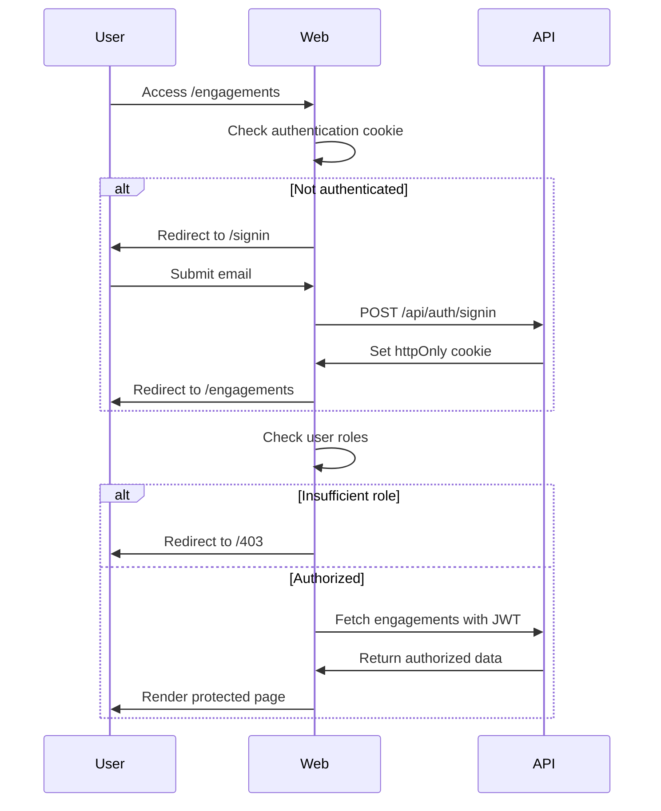

# ADR-001: Authentication and Authorization Architecture

**Status:** ✅ Implemented  
**Date:** 2025-08-17  
**Sprint:** S1  

## Context

Sprint S1 requires implementing a comprehensive authentication and authorization system that supports:
- Server-Side Rendering (SSR) route guards for protected pages
- Role-Based Access Control (RBAC) with Member, LEM, and Admin roles
- Structured logging with correlation ID propagation
- JWT validation for API endpoints
- Demo authentication mode for development and testing

## Decision

We have implemented a dual-mode authentication system that supports both production OIDC flows and demo authentication for development.

### Architecture Components

#### 1. **Server-Side Route Guards**
- **Location:** `/web/app/engagements/page.tsx`
- **Implementation:** SSR async components with authentication checks
- **Behavior:** 
  - Unauthenticated users → redirect to `/signin`
  - Users without sufficient roles → redirect to `/403`
  - Authenticated users with proper roles → allow access

```typescript
export default async function EngagementsPage() {
  const user = await getDemoUser();
  
  if (!user) {
    redirect('/signin');
  }
  
  if (!hasAccess) {
    redirect('/403');
  }
  
  // Render protected content
}
```

#### 2. **Demo Authentication System**
- **Cookie-based:** Uses `demo-email` httpOnly cookie for SSR compatibility
- **API Route:** `/api/auth/signin` for setting authentication state
- **Mock User Data:** Returns role-based mock user for testing
- **Security:** httpOnly cookies with proper sameSite and secure flags

#### 3. **API Authentication & RBAC**
- **JWT Middleware:** `/app/api/middleware/jwt_auth.py`
- **RBAC Implementation:** Role validation for Admin, LEM, Member, Viewer
- **Header Requirements:** `X-User-Email` and `X-Engagement-ID` for requests
- **Error Handling:** 401 for authentication, 403 for authorization failures

#### 4. **Correlation ID Propagation**
- **Middleware:** `/web/middleware.ts` for request correlation
- **Logging:** Structured JSON logging with correlation IDs
- **Format:** UUID v4 generated per request chain
- **Propagation:** Headers and server-side logging throughout request lifecycle

## Implementation Details

### Authentication Flows



### Role Hierarchy

| Role | Permissions | Description |
|------|-------------|-------------|
| **Admin** | Full access to all features | System administrators |
| **LEM** | Lead engagement management | Lead Engagement Managers |
| **Member** | Standard engagement access | Team members |
| **Viewer** | Read-only access | Observers and stakeholders |

### Security Considerations

1. **Cookie Security**
   - HttpOnly: Prevents XSS access to auth tokens
   - Secure: HTTPS-only in production
   - SameSite: CSRF protection
   - Path-specific: Scoped to application

2. **JWT Validation**
   - Signature verification on all API requests
   - Role-based access control enforcement
   - Expiration validation
   - Issuer and audience verification

3. **Error Handling**
   - No sensitive information in error responses
   - Proper HTTP status codes (401, 403, 500)
   - Structured logging for security events

## Consequences

### Positive

✅ **SSR Compatibility:** Authentication works with server-side rendering  
✅ **Security:** HttpOnly cookies prevent XSS, RBAC prevents unauthorized access  
✅ **Developer Experience:** Demo mode allows easy testing without external dependencies  
✅ **Observability:** Correlation IDs enable request tracing across services  
✅ **Compliance:** Structured logging supports audit requirements  

### Negative

⚠️ **Demo Mode Security:** Should be disabled in production environments  
⚠️ **Cookie Dependency:** Requires cookie support in client browsers  
⚠️ **SSR Overhead:** Authentication checks on every protected page render  

### Risks and Mitigations

| Risk | Mitigation |
|------|------------|
| **Demo Mode in Production** | Environment-based feature flags, CI/CD validation |
| **Cookie Manipulation** | HttpOnly, secure, signed cookies with expiration |
| **Role Escalation** | Server-side role validation, immutable role assignments |
| **Correlation ID Collision** | UUID v4 generation, timestamp-based fallbacks |

## Alternative Considered

1. **Client-Side Authentication:** Rejected due to SSR requirements and security concerns
2. **Session-Based Auth:** Rejected due to scalability and stateless API requirements  
3. **Local Storage:** Rejected due to SSR incompatibility and XSS vulnerability

## Status

**Current Implementation:**
- ✅ SSR route guards implemented and tested
- ✅ Demo authentication with cookie management
- ✅ API JWT validation and RBAC middleware
- ✅ Correlation ID propagation and structured logging
- ✅ Comprehensive E2E test coverage

**Next Phase (S2):**
- 🔄 Production OIDC integration with Microsoft Entra ID
- 🔄 Advanced role management and group assignments
- 🔄 Session management and refresh token handling
- 🔄 Multi-tenant support with engagement-scoped permissions

## References

- [Sprint S1 Requirements](../README.md#authentication-quickstart-sprint-s1)
- [Security Implementation](./SECURITY.md)
- [E2E Test Coverage](../web/e2e/tests/engagements.spec.ts)
- [Verification Script](../scripts/verify_s1_live.sh)