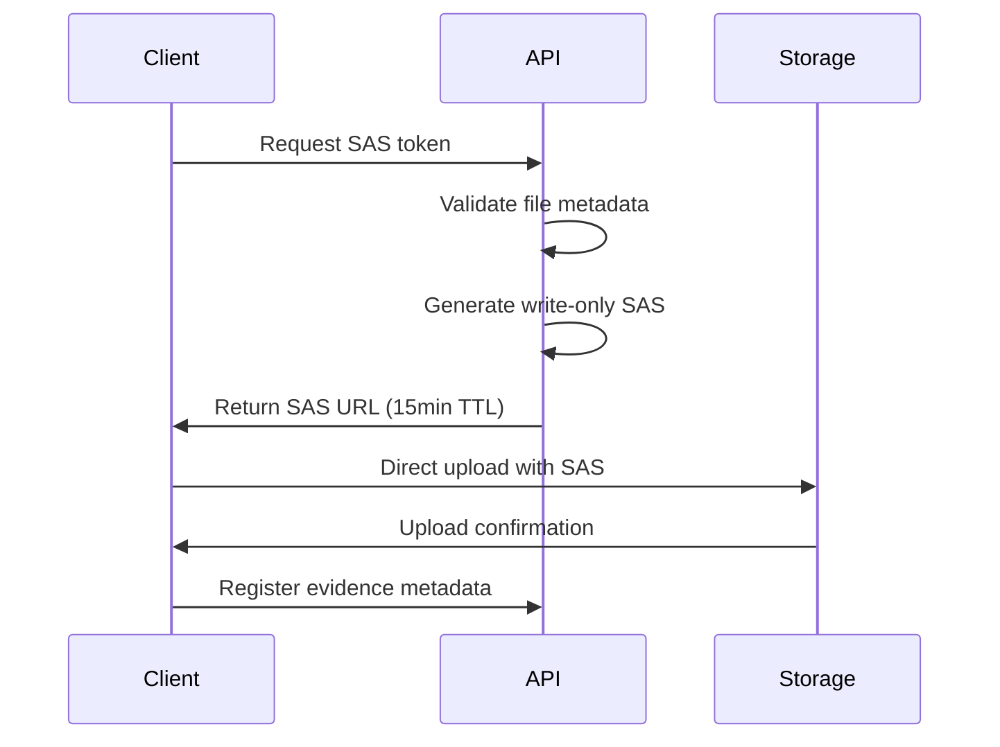

# ADR-003: Evidence Ingestion Architecture

**Status:** ✅ Implemented  
**Date:** 2025-08-18  
**Sprint:** Phase 3  

## Context

The assessment platform requires secure evidence upload capabilities to support maturity evaluations. Evidence files must be handled with appropriate security controls while maintaining usability and performance.

## Decision

We implement a write-only SAS token architecture with client-direct uploads to Azure Blob Storage, bypassing the API for file transfers while maintaining security controls.

### Architecture Components

#### 1. **SAS Token Generation**
- **TTL:** 15 minutes maximum lifetime
- **Permissions:** Write-only (wca: write, create, add)
- **Scope:** Container-level with unique blob paths
- **Validation:** Server-side token generation with audit logging

#### 2. **File Size Caps**
- **Maximum Size:** 50MB per file
- **Enforcement:** Client-side validation + Azure Storage limits
- **Rationale:** Prevents storage abuse and DoS attacks
- **Monitoring:** Track upload patterns for anomaly detection

#### 3. **MIME Type Allow-list**
- **Allowed Types:**
  - Documents: `application/pdf`, `application/vnd.openxmlformats-officedocument.*`
  - Images: `image/jpeg`, `image/png`, `image/gif`
  - Text: `text/plain`, `text/csv`
- **Validation:** Client-side pre-flight + server-side verification
- **Rejection:** Non-allowed types blocked at SAS generation

#### 4. **Checksum & PII Controls**
- **Checksum:** MD5 validation for integrity verification
- **PII Scanning:** Deferred to Phase 4 (pattern matching implementation)
- **Encryption:** Azure Storage encryption-at-rest enabled
- **Access Logs:** Blob access tracking for compliance

#### 5. **Storage Isolation**
- **Container Strategy:** Separate containers per environment
- **Path Structure:** `/evidence/{engagement_id}/{assessment_id}/{file_id}`
- **Access Control:** Managed Identity with least-privilege RBAC
- **Retention:** 90-day automatic deletion policy

## Implementation Details

### Upload Flow

### Security Controls

| Control | Implementation | Risk Mitigation |
|---------|---------------|-----------------|
| **Short TTL** | 15-minute expiry | Limits exposure window |
| **Write-Only** | No read/list/delete | Prevents data exfiltration |
| **Size Limits** | 50MB cap | DoS protection |
| **Type Filtering** | MIME allow-list | Malware prevention |
| **Path Isolation** | Unique blob paths | Cross-tenant protection |

## Consequences

### Positive
✅ **Performance:** Direct client uploads reduce API load  
✅ **Security:** Write-only tokens prevent data leaks  
✅ **Scalability:** Azure Storage handles concurrent uploads  
✅ **Auditability:** Comprehensive logging of all operations  

### Negative
⚠️ **Complexity:** Client-side upload orchestration required  
⚠️ **Cost:** Storage costs scale with usage  
⚠️ **PII Risk:** Manual review needed until scanning implemented  

## Alternatives Considered

1. **API Proxy Upload:** Rejected due to performance and memory constraints
2. **Permanent SAS Tokens:** Rejected due to security exposure risk
3. **Public Container:** Rejected due to data confidentiality requirements

## References

- [Azure SAS Best Practices](https://docs.microsoft.com/azure/storage/common/storage-sas-overview)
- [Security Implementation](./SECURITY.md#evidence-upload-security)
- [Storage Configuration](../app/storage/blob_store.py)