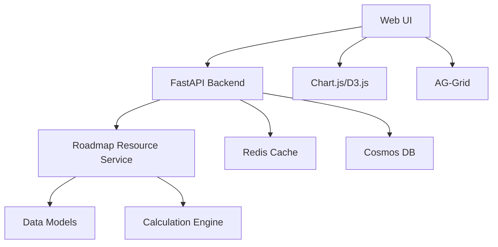

# UX Roadmap v2 Documentation

## Overview

The UX Roadmap v2 represents a significant enhancement to the cybersecurity maturity assessment platform, introducing advanced resource planning, interactive wave management, and comprehensive skill mapping capabilities. This version provides organizations with sophisticated tools for planning and executing cybersecurity initiatives across multiple waves.

## Table of Contents

- [Features](#features)
- [Architecture](#architecture)
- [Data Models](#data-models)
- [Formulas and Calculations](#formulas-and-calculations)
- [Default Configurations](#default-configurations)
- [API Reference](#api-reference)
- [User Interface Guide](#user-interface-guide)
- [Performance Optimization](#performance-optimization)
- [Accessibility Features](#accessibility-features)
- [Usage Examples](#usage-examples)
- [Troubleshooting](#troubleshooting)
- [Migration Guide](#migration-guide)

## Features

### Core Capabilities

#### 🎯 **Wave-Based Planning**
- **Multi-wave Initiative Management**: Break down large cybersecurity initiatives into manageable waves
- **Resource Allocation**: Automated resource planning across waves based on initiative complexity
- **Critical Path Analysis**: Identify critical waves that impact overall timeline
- **Dependencies Tracking**: Manage dependencies between waves and initiatives

#### 📊 **Resource Profile Management**
- **Skill-Based Planning**: Map required skills to specific roles and initiatives
- **FTE Demand Forecasting**: Calculate Full-Time Equivalent requirements across time periods
- **Cost Estimation**: Automated cost calculation based on role types and durations
- **Capacity Analysis**: Compare resource demand against available capacity

#### 🔄 **Real-Time Adjustments**
- **Dynamic Weight Adjustment**: Real-time score recalculation when weights change
- **Cost Optimization**: Interactive cost adjustment with immediate impact visualization
- **Resource Rebalancing**: Automatic wave rebalancing when resource profiles change
- **Live Updates**: Instant UI updates without page refresh

#### 📈 **Advanced Visualizations**
- **Wave Overlay Charts**: Visual representation of resource utilization across waves
- **Skill Demand Heatmaps**: Time-based visualization of skill requirements
- **Gantt Chart Integration**: Timeline view with resource allocation overlay
- **Performance Dashboards**: Real-time performance metrics and monitoring

### Feature Flags

The system uses two primary feature flags:

- **`ROADMAP_V2`**: Enables the core v2 roadmap functionality
- **`UX_ASSESSMENT_V2`**: Enables enhanced UX features like interactive sliders and drag-drop

## Architecture

### High-Level Architecture



### Component Structure

```
/roadmap-v2/
├── services/
│   ├── roadmap_resource_profile.py      # Core service logic
│   └── performance.py                   # Performance monitoring
├── schemas/
│   ├── resource_profile.py              # API schemas
│   └── wave_allocation.py               # Wave-specific schemas
├── routes/
│   └── roadmap_resource_profile.py      # API endpoints
├── web/
│   ├── components/
│   │   ├── RoadmapV2Container.tsx       # Main container
│   │   ├── WaveOverlayChart.tsx         # Wave visualization
│   │   ├── ResourceProfilePanel.tsx     # Resource management
│   │   └── SkillDemandForecast.tsx      # Skill forecasting
│   └── tests/
│       └── roadmap-ux-v2.spec.ts        # E2E tests
```

## Data Models

### Core Models

#### ResourcePlanningRequest
```python
class ResourcePlanningRequest(BaseModel):
    initiatives: List[Dict]              # List of initiatives to plan
    wave_duration_weeks: int = 12        # Default wave duration
    target_start_date: Optional[date]    # Planning start date
    planning_horizon_weeks: int = 52     # Planning horizon
    skill_constraints: Optional[Dict[str, int]] = None  # Skill availability
```

#### WaveResourceAllocation
```python
class WaveResourceAllocation(BaseModel):
    wave: WavePhase                      # Wave identifier (wave_1, wave_2, etc.)
    wave_name: str                       # Human-readable wave name
    start_date: date                     # Wave start date
    end_date: date                       # Wave end date
    role_allocations: List[RoleProfile]  # Required roles for this wave
    total_fte: Optional[float]           # Total FTE requirement
    estimated_cost: Optional[float]      # Estimated wave cost
    critical_path: bool = False          # Is this wave on critical path
```

#### RoleProfile
```python
class RoleProfile(BaseModel):
    role_type: RoleType                  # SECURITY_ARCHITECT, SECURITY_ENGINEER, etc.
    role_title: str                      # Human-readable role title
    fte_required: float                  # FTE requirement (0.0 - 2.0)
    duration_weeks: int                  # Duration in weeks
    skill_requirements: List[SkillRequirement]  # Required skills
    seniority_level: str                 # junior, mid, senior, principal
    remote_eligible: bool = True         # Can this role work remotely
    hourly_rate_range: Optional[Dict]    # Cost information
```

#### SkillRequirement
```python
class SkillRequirement(BaseModel):
    skill_name: str                      # Name of the skill
    skill_category: str                  # technical, compliance, management, analytical
    required_level: SkillLevel           # BEGINNER, INTERMEDIATE, ADVANCED, EXPERT
    critical: bool = False               # Is this skill critical for success
```

### Enumerations

#### RoleType
```python
class RoleType(str, Enum):
    SECURITY_ARCHITECT = "security_architect"
    SECURITY_ENGINEER = "security_engineer"
    COMPLIANCE_ANALYST = "compliance_analyst"
    PROJECT_MANAGER = "project_manager"
```

#### SkillLevel
```python
class SkillLevel(str, Enum):
    BEGINNER = "beginner"               # Basic understanding
    INTERMEDIATE = "intermediate"        # Working knowledge
    ADVANCED = "advanced"               # Deep expertise
    EXPERT = "expert"                   # Industry-leading expertise
```

#### WavePhase
```python
class WavePhase(str, Enum):
    WAVE_1 = "wave_1"                   # Planning and architecture
    WAVE_2 = "wave_2"                   # Initial implementation
    WAVE_3 = "wave_3"                   # Core implementation
    WAVE_4 = "wave_4"                   # Advanced implementation
    WAVE_5 = "wave_5"                   # Testing and closure
```

## Formulas and Calculations

### Score Calculation

The roadmap v2 uses enhanced scoring formulas that incorporate weights and custom cost factors:

#### Weighted Score Formula
```
Weighted_Score = Σ(Category_Score × Category_Weight) / Σ(Category_Weight)
```

#### Initiative Score Impact
```
Initiative_Impact = (Gap_Score × Complexity_Multiplier × Priority_Weight) / 100
where:
  Gap_Score = Target_Score - Current_Score
  Complexity_Multiplier = Size_Factor × Technical_Complexity
  Priority_Weight = Business_Priority × Risk_Factor
```

### Resource Calculations

#### FTE Demand Calculation
```
Wave_FTE_Demand = Σ(Role_FTE × Overlap_Factor × Efficiency_Factor)
where:
  Overlap_Factor = Accounts for role overlap between waves
  Efficiency_Factor = Team productivity adjustments (0.7 - 1.2)
```

#### Cost Estimation Formula
```
Wave_Cost = Σ(Role_FTE × Duration_Weeks × 40_Hours × Hourly_Rate × Location_Factor)
where:
  Hourly_Rate = Base rate by seniority level
  Location_Factor = Geographic cost adjustment (0.8 - 1.5)
```

#### Skill Demand Forecasting
```
Skill_Demand(t) = Σ(Initiative_Skill_Need × Wave_Timeline_Overlap × Urgency_Factor)
where:
  t = Time period (month/quarter)
  Wave_Timeline_Overlap = Percentage of wave active in period t
  Urgency_Factor = Criticality multiplier for urgent initiatives
```

### Performance Calculations

#### P95 Response Time Target
```
P95_Threshold = 2000ms (2 seconds)
Performance_Score = max(0, 100 - (Actual_P95 - Target_P95) / 10)
```

## Default Configurations

### Wave Duration Defaults
```yaml
Default Wave Duration: 12 weeks
Minimum Wave Duration: 4 weeks
Maximum Wave Duration: 26 weeks
Default Planning Horizon: 52 weeks (1 year)
Maximum Planning Horizon: 156 weeks (3 years)
```

### Role Templates
```yaml
Security Architect:
  Default FTE: 1.0
  Typical Duration: 12 weeks
  Seniority: senior
  Hourly Rate: $180/hour

Security Engineer:
  Default FTE: 1.0
  Typical Duration: 8 weeks
  Seniority: mid
  Hourly Rate: $140/hour

Compliance Analyst:
  Default FTE: 0.5
  Typical Duration: 16 weeks
  Seniority: mid
  Hourly Rate: $140/hour

Project Manager:
  Default FTE: 0.75
  Typical Duration: 20 weeks
  Seniority: senior
  Hourly Rate: $180/hour
```

### Skill Categories
```yaml
Technical Skills:
  - Cloud Security Architecture
  - Network Security
  - Identity and Access Management
  - Vulnerability Assessment
  - Incident Response
  - Security Automation
  - Cryptography

Compliance Skills:
  - SOC 2 Compliance
  - ISO 27001
  - NIST Framework
  - GDPR Compliance
  - Risk Assessment

Management Skills:
  - Project Management
  - Program Management
  - Stakeholder Management
  - Change Management

Analytical Skills:
  - Threat Intelligence
  - Security Metrics
  - Data Analysis
  - Business Impact Analysis
```

## API Reference

### Core Endpoints

#### Calculate Resource Profile
```http
POST /api/roadmap/resource-profile/calculate
Content-Type: application/json

{
  "initiatives": [
    {
      "initiative_id": "init-001",
      "name": "Zero Trust Implementation",
      "t_shirt_size": "L",
      "duration_weeks": 36,
      "type": "security_implementation",
      "priority": "high"
    }
  ],
  "wave_duration_weeks": 12,
  "target_start_date": "2025-01-01",
  "planning_horizon_weeks": 52,
  "skill_constraints": {
    "security_architect": 2,
    "security_engineer": 4
  }
}
```

**Response:**
```json
{
  "initiative_profiles": [
    {
      "initiative_id": "init-001",
      "initiative_name": "Zero Trust Implementation",
      "total_duration_weeks": 36,
      "wave_allocations": [
        {
          "wave": "wave_1",
          "wave_name": "Wave 1: Zero Trust Implementation",
          "start_date": "2025-01-01",
          "end_date": "2025-03-26",
          "role_allocations": [
            {
              "role_type": "security_architect",
              "role_title": "Senior Security Architect",
              "fte_required": 1.5,
              "duration_weeks": 12,
              "seniority_level": "senior"
            }
          ],
          "total_fte": 3.25,
          "estimated_cost": 187200,
          "critical_path": true
        }
      ],
      "total_fte_demand": 2.85,
      "total_estimated_cost": 520000,
      "resource_constraints": []
    }
  ],
  "planning_summary": {
    "total_initiatives": 1,
    "total_fte_demand": 2.85,
    "total_estimated_cost": 520000
  }
}
```

#### Export Resource Plan
```http
POST /api/roadmap/resource-profile/export
Content-Type: application/json

{
  "export_format": "detailed",
  "initiative_ids": ["init-001"],
  "include_skills": true,
  "include_costs": true
}
```

#### Generate Gantt Chart Data
```http
POST /api/roadmap/resource-profile/gantt
Content-Type: application/json

{
  "initiative_ids": ["init-001", "init-002"],
  "include_resource_overlay": true,
  "include_skill_heatmap": true
}
```

#### Wave Overlay Visualization
```http
POST /api/roadmap/resource-profile/wave-overlay
Content-Type: application/json

{
  "planning_horizon_weeks": 60,
  "aggregate_by": "month"
}
```

### Configuration Endpoints

#### Get Configuration Info
```http
GET /api/roadmap/resource-profile/config
```

**Response:**
```json
{
  "available_roles": [
    {
      "role_type": "security_architect",
      "description": "Senior Security Architect",
      "typical_fte": 1.0,
      "typical_duration": 12,
      "seniority_level": "senior"
    }
  ],
  "skill_mapping": {
    "available_skills": [...],
    "skill_categories": ["technical", "compliance", "management", "analytical"],
    "proficiency_definitions": {...}
  },
  "default_wave_duration": 12,
  "max_planning_horizon": 156,
  "supported_export_formats": ["summary", "detailed", "skills_matrix"]
}
```

## User Interface Guide

### Navigation

1. **Enable Feature Flags**: Ensure `ROADMAP_V2=1` and `UX_ASSESSMENT_V2=1` in environment
2. **Access Roadmap**: Navigate to `/e/{engagementId}/dashboard` and click "Roadmap" tab
3. **Interactive Controls**: Use the enhanced UX controls for real-time adjustments

### Main Interface Components

#### Wave Overlay Chart
- **Purpose**: Visualize resource utilization across multiple waves
- **Interactions**: 
  - Hover over waves to see detailed resource breakdown
  - Click waves to drill down into specific resource allocations
  - Use timeline controls to adjust planning horizon

#### Resource Profile Panel
- **Purpose**: Configure and adjust resource requirements
- **Features**:
  - Skill requirement sliders (when UX_ASSESSMENT_V2 enabled)
  - Role allocation inputs with real-time validation
  - Cost estimation with immediate updates

#### Weight and Cost Adjustment Interface
- **Purpose**: Fine-tune assessment scoring and initiative costs
- **Interactions**:
  - Drag sliders to adjust category weights
  - Input custom cost factors for initiatives
  - See real-time score and wave cost updates

### Keyboard Navigation

- **Tab**: Navigate between interactive elements
- **Arrow Keys**: Navigate within grids and charts
- **Enter/Space**: Activate buttons and controls
- **Escape**: Close modals and dropdown menus

### Accessibility Features

- **ARIA Labels**: All interactive elements have descriptive labels
- **Live Regions**: Dynamic updates announced to screen readers
- **High Contrast**: Support for high contrast mode
- **Keyboard Navigation**: Full functionality available via keyboard
- **Focus Management**: Clear focus indicators and logical tab order

## Performance Optimization

### Grid Virtualization

For large datasets (>100 rows), the system automatically enables grid virtualization:

```typescript
// Grid configuration
const gridOptions = {
  enableVirtualization: dataset.length > 100,
  virtualRowHeight: 40,
  bufferSize: 50,
  debounceVerticalScrollbar: true
};
```

### Performance Thresholds

- **Grid Operations**: P95 < 2000ms
- **Score Updates**: P95 < 800ms
- **Roadmap Load**: P95 < 1500ms
- **Real-time Updates**: < 500ms

### Optimization Techniques

#### Client-Side Caching
```typescript
const cacheConfig = {
  maxAge: 5 * 60 * 1000, // 5 minutes
  maxSize: 100,          // 100 entries
  staleWhileRevalidate: true
};
```

#### Debounced Updates
```typescript
const debouncedUpdate = useMemo(
  () => debounce(updateScores, 300),
  []
);
```

#### Memory Management
- Automatic cleanup of unused chart instances
- Efficient data structures for large skill matrices
- Lazy loading of non-critical components

## Usage Examples

### Example 1: Basic Wave Planning

```typescript
// 1. Enable feature flags
localStorage.setItem('ROADMAP_V2', '1');
localStorage.setItem('UX_ASSESSMENT_V2', '1');

// 2. Navigate to roadmap
window.location.href = '/e/my-engagement/dashboard#roadmap';

// 3. Configure initiative
const initiative = {
  name: "Cloud Security Modernization",
  t_shirt_size: "L",
  duration_weeks: 24,
  priority: "high"
};

// 4. Generate wave plan
await fetch('/api/roadmap/resource-profile/calculate', {
  method: 'POST',
  headers: { 'Content-Type': 'application/json' },
  body: JSON.stringify({
    initiatives: [initiative],
    wave_duration_weeks: 12
  })
});
```

### Example 2: Interactive Weight Adjustment

```typescript
// 1. Locate weight control
const weightSlider = document.querySelector('[data-testid="weight-input"]');

// 2. Adjust weight
weightSlider.value = '1.5';
weightSlider.dispatchEvent(new Event('change'));

// 3. Verify real-time update
const scoreElement = document.querySelector('[data-testid="total-score"]');
// Score updates automatically within 500ms
```

### Example 3: Resource Profile Customization

```typescript
// 1. Open resource profile editor
await page.click('[data-testid="resource-profile-edit"]');

// 2. Update skill requirements
const skills = [
  { name: 'cloud-security-architecture', level: 'expert' },
  { name: 'network-security', level: 'advanced' }
];

for (const skill of skills) {
  await page.selectOption(
    `[data-testid="skill-${skill.name}"]`, 
    skill.level
  );
}

// 3. Save changes
await page.click('[data-testid="save-resource-profile"]');
```

### Example 4: CSV Export

```typescript
// 1. Configure export options
const exportConfig = {
  export_format: 'detailed',
  include_skills: true,
  include_costs: true,
  initiative_ids: ['init-001', 'init-002']
};

// 2. Request export
const response = await fetch('/api/roadmap/resource-profile/export', {
  method: 'POST',
  headers: { 'Content-Type': 'application/json' },
  body: JSON.stringify(exportConfig)
});

// 3. Download file
const blob = await response.blob();
const url = URL.createObjectURL(blob);
const a = document.createElement('a');
a.href = url;
a.download = 'resource_planning.csv';
a.click();
```

### Example 5: Performance Monitoring

```typescript
// Monitor grid performance
const observer = new PerformanceObserver((list) => {
  const entries = list.getEntries();
  entries.forEach(entry => {
    if (entry.name.includes('grid-operation')) {
      console.log(`Grid operation: ${entry.duration}ms`);
      if (entry.duration > 2000) {
        console.warn('Grid operation exceeded p95 threshold');
      }
    }
  });
});

observer.observe({ entryTypes: ['measure'] });
```

## Troubleshooting

### Common Issues

#### Feature Flags Not Working
```bash
# Check environment configuration
curl -s "${API_BASE_URL}/api/ops/config" | grep -E "(ROADMAP_V2|UX_ASSESSMENT_V2)"

# Expected output:
# "ROADMAP_V2": "1"
# "UX_ASSESSMENT_V2": "1"
```

#### Slow Performance
```typescript
// Check if virtualization is enabled
const gridApi = document.querySelector('.ag-grid').gridApi;
console.log('Virtualization enabled:', gridApi.isVirtualizationEnabled());

// Monitor performance metrics
performance.mark('roadmap-start');
// ... operations ...
performance.mark('roadmap-end');
performance.measure('roadmap-operation', 'roadmap-start', 'roadmap-end');
```

#### Score Not Updating
```typescript
// Check for JavaScript errors
console.log('Last error:', window.lastError);

// Verify weight input
const weightInput = document.querySelector('[data-testid="weight-input"]');
console.log('Weight value:', weightInput.value);

// Check live region for updates
const liveRegion = document.querySelector('[aria-live="polite"]');
console.log('Announcements:', liveRegion.textContent);
```

#### Resource Profile Issues
```bash
# Test endpoint availability
curl -X GET "${API_BASE_URL}/api/roadmap/resource-profile/config"

# Check database connectivity
curl -X POST "${API_BASE_URL}/api/roadmap/resource-profile/calculate" \
  -H "Content-Type: application/json" \
  -d '{"initiatives":[]}'
```

### Debug Mode

Enable debug mode for detailed logging:

```bash
# Environment variable
DEBUG_MODE=true

# Or in browser console
localStorage.setItem('debug_mode', 'true');
```

### Performance Debugging

```typescript
// Enable performance monitoring
window.PERF_MONITORING_ENABLED = true;

// View performance metrics
console.table(window.performanceMetrics);

// Check memory usage
console.log('Memory usage:', performance.memory);
```

## Migration Guide

### Upgrading from Roadmap v1

#### Step 1: Enable Feature Flags
```bash
# In environment configuration
ROADMAP_V2=1
UX_ASSESSMENT_V2=1
```

#### Step 2: Database Migration
```python
# Run migration script
python scripts/migrate_roadmap_v2.py

# Verify migration
python scripts/verify_roadmap_migration.py
```

#### Step 3: Update API Calls
```typescript
// Old v1 API
const response = await fetch('/api/roadmap/calculate');

// New v2 API
const response = await fetch('/api/roadmap/resource-profile/calculate', {
  method: 'POST',
  headers: { 'Content-Type': 'application/json' },
  body: JSON.stringify(requestData)
});
```

#### Step 4: Update UI Components
```typescript
// Replace v1 components
import { RoadmapV1Container } from './v1/RoadmapContainer';

// With v2 components
import { RoadmapV2Container } from './v2/RoadmapContainer';
```

### Backward Compatibility

The system maintains backward compatibility through feature flags:

- When `ROADMAP_V2=0`: Uses legacy v1 interface
- When `ROADMAP_V2=1`: Uses new v2 interface with fallback support
- Gradual migration supported through parallel operation

### Data Format Changes

#### Wave Structure (v1 → v2)
```typescript
// v1 format
interface WaveV1 {
  id: string;
  name: string;
  duration: number;
}

// v2 format
interface WaveV2 {
  wave: WavePhase;
  wave_name: string;
  start_date: Date;
  end_date: Date;
  role_allocations: RoleProfile[];
  total_fte: number;
  estimated_cost: number;
  critical_path: boolean;
}
```

### Testing Migration

```bash
# Run comprehensive tests
npm run test:roadmap-v2

# Run E2E migration tests
npx playwright test tests/migration-v1-to-v2.spec.ts

# Verify performance
./scripts/verify_live.sh --ux-roadmap
```

---

*This documentation is maintained by the AI-Enabled Cyber Maturity Assessment team. For questions or issues, please contact the development team or create an issue in the project repository.*

**Last Updated**: Sprint v1.8 - August 2025
**Version**: 2.0.0
**Status**: Production Ready